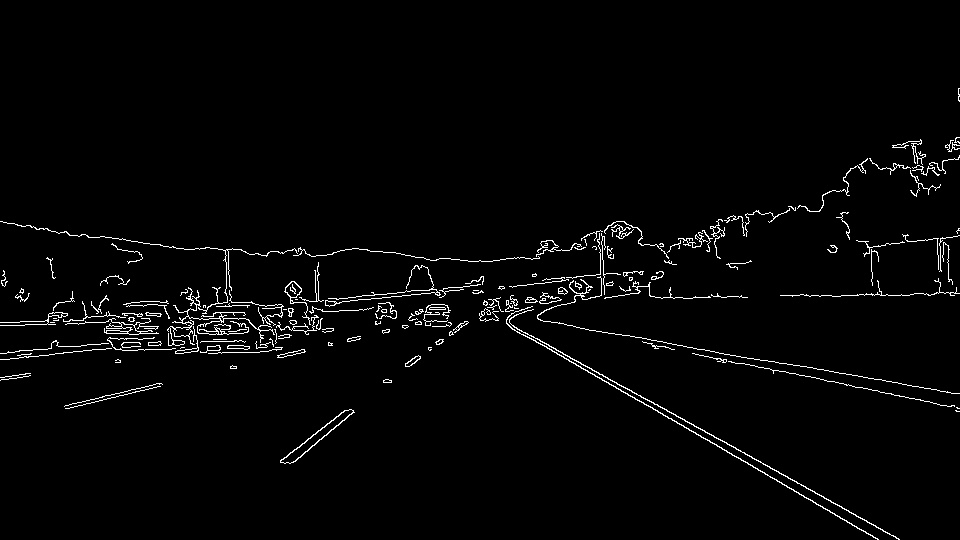
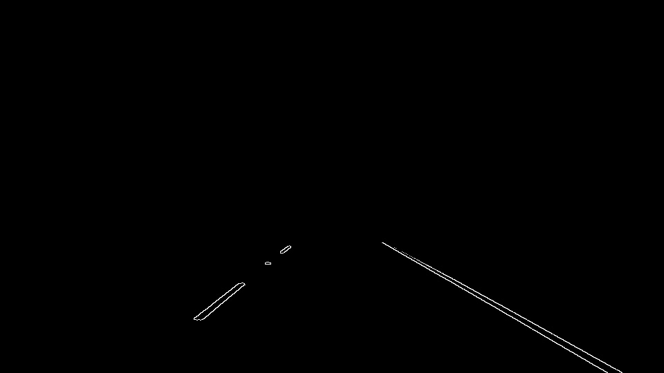
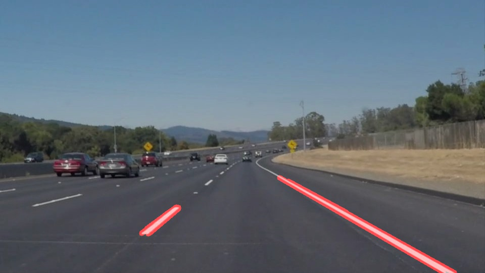
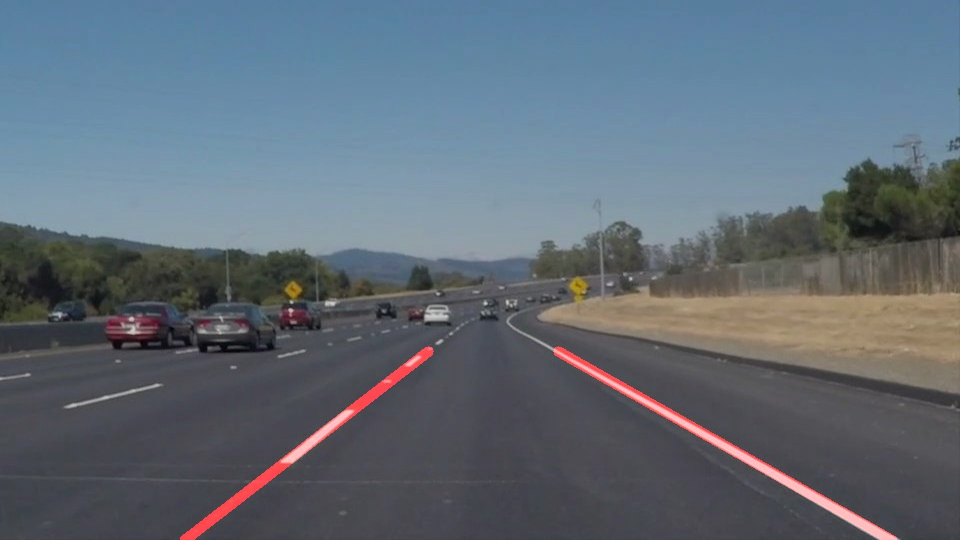

# Finding Lane Lines on the Road

## Reflection

### 1. Describe your pipeline. As part of the description, explain how you modified the draw_lines() function.

**Step 1: Turn the images into grayscale**

**Step 2: Apply Gaussian blur**

The kernel size is 5.

**Step 3: Apply Canny edge detection**

The min threshold is 60, and the max is 180.

**Step 4: Crop the images**

Using `cv2.polyfill()` method to crop the image, so that the next step can only force on the area that contains target lanes.

**Step 5: Using Hough Transform to find lines**

**Step 6: Extrapolate lines**

I don't modify the `draw_lines()` function directly, but implement another `extrapolate_lines()` function. In this method, I first calculate all slops of hough lines, then split these slops into 2 groups, one of which has positive slops, another has negative. I hard code two boundary values, which will be used to filter noise lines (e.g., stain on the road, these stains will affect fitting the lines). Next, I deconstruct the hough lines into vertexes coordinate and using `cv2.polyfit()` to fit `y = mx + b` equation. After that, I rearrange the formula to get `x = (y - b) / m` and use `y` top and bottom boundary values to generate according `x` values. Finally, I return these `x` and `y` as 2 lines.

### 2. Identify potential shortcomings with your current pipeline

* When there're some other lines within the lane area, the program would make a mistake.
* When there're some other object within the lane area (people or another car), the program would make a mistake.
* When there're some stains on the road, especially the stains looks like a horizontal line, the program would make a mistake. I resolve this problem by fixing the slop range, any slop that beyond this range will be rejected.
* When there're some reflection on the car window, which looks like a horizontal line, the program would make a mistake.

### 3. Suggest possible improvements to your pipeline

1. Should not use the hard coded slop boundary, that values should be generated by some statistical method.
2. When cropping the image using `cv2.polyfill()` method, I could use two polygons to mask the left and right lane area, then the algorithm would be robust against noises.
3. I can use the color filter to find white and yellow lines.
