# Build a Traffic Sign Recognition Classifier

**Table of Contents**

1. Dataset Summary & Exploration
2. Design and Test a Model Architecture
3. Test a Model on New Images

## Dataset Summary & Exploration

### Basic Dataset Summary

This dataset consists of 3 subsets: the training set, the validation set and the test set. Each image in the dataset is of 32x32x3 shape, which means the width and the height of the images are all 32, and every image has 3 color channels (RGB). The total count of classes is 43.

Here's a brief summary of each set:

| Dataset       	 | Total Count	   			|
|:-----------------|---------------------:|
| Training         | 34700   							|
| Validation     	 | 4410     	          |
| Test    				 | 12630								|

### Exploration

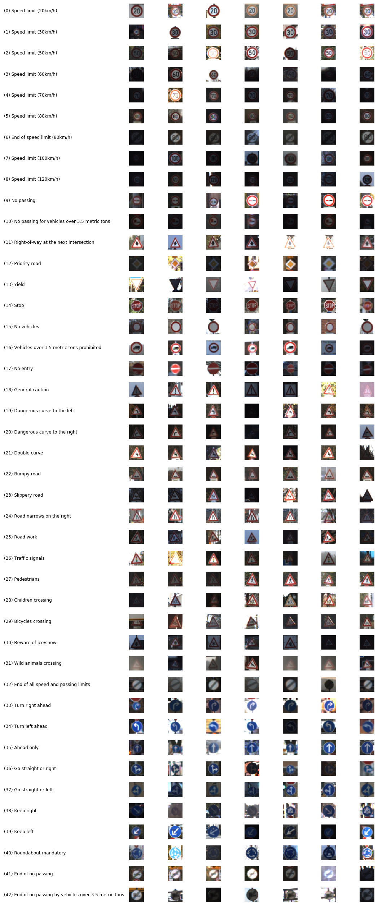

The total count of each class is not evenly distributed. Some class has more than 2000 samples, and some less than 200. Please check the following figure for details.

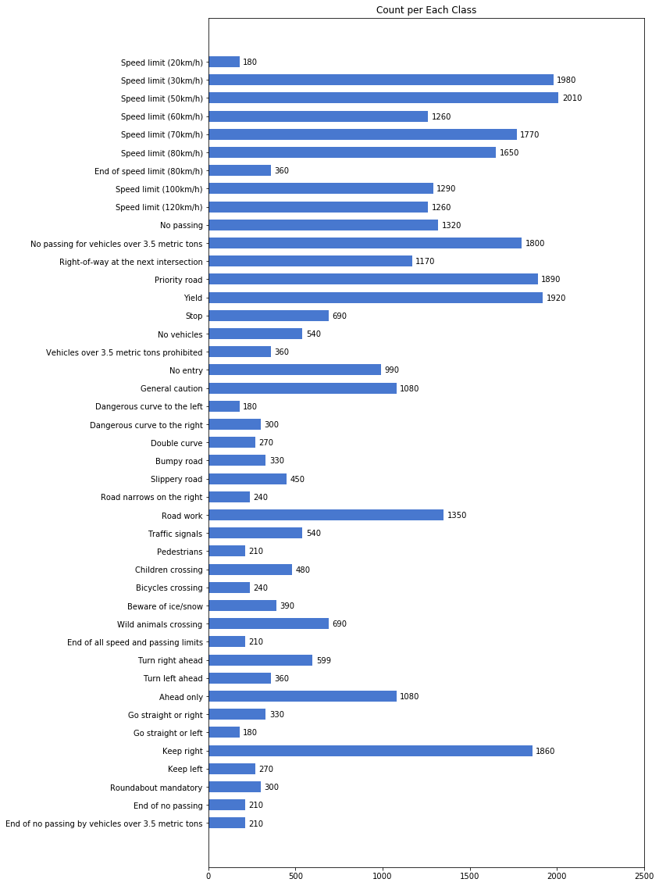

## Design and Test a Model Architecture

### Augmentation

Since this is a small dataset, when training a deep neural network, it's easy to overfit the training set. One solution to prevent the overfitting is to increase the size of data.

For image processing task, we can do augmentation to add more samples.

* Brightness augmentation
* Cropping
* Adding Gaussian blur
* Contrast normalization
* Affine transform

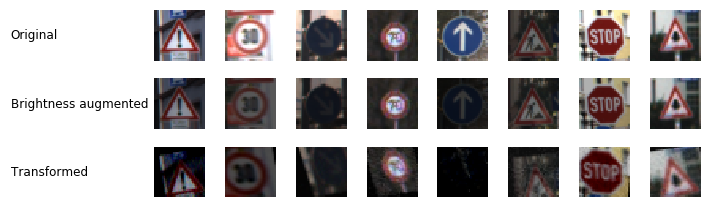

Thanks for the [imgaug](https://github.com/aleju/imgaug) library, it makes these jobs easy.

### Preprocess

There're many ways to do preprocess, like rescaling, standarization, stretching and etc.

I did grayscaling and normalization.

#### Grayscaling

I plotted some figures to show the distribution of each color channel.

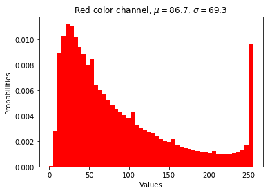
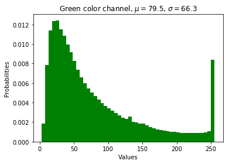
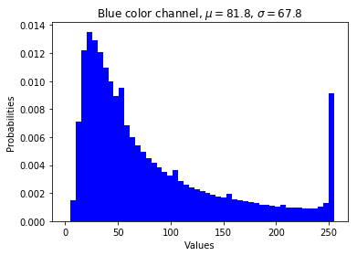
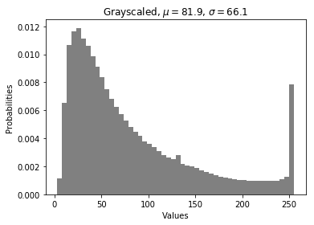

Form these figures, we can see that the color distribution in different channels seems to be similar. The dataset is stationary. It means that the color variance does not provide more information amount this dataset, the only meaningful information is the shape of objects in it. So we could convert color images into grayscaled images to reduce the amount of calculation.

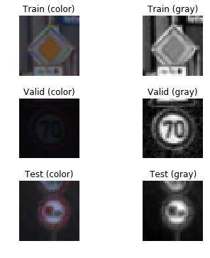

By the way, some images after grayscaling become clearer.

#### Normalization

When processing natural images, we often obtain pixel values in the range [0, 255]. It is a best practice to set each dimension of the data to have zero-mean and unit-variance. To achieve this I firstly compute the mean of each dimension (across the dataset) and subtract this from each dimension. Then each dimension is divided by its standard deviation. This can make the data centered around zero mean and distributed normally.

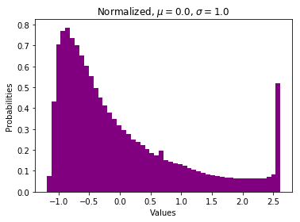

In the process of training neural networks, we're going to be multiplying (weights) and adding to (biases) the initial inputs, in order to cause activations that we then back-propagate with the gradients to train the model. We'd like in this process for each feature to have a similar range so that the gradients won't go out of control.

### Model Architecture

I use a [VGG16](https://www.cs.toronto.edu/~frossard/post/vgg16/) like model architecture.

The VGG16 architecture can solve the more complex dataset ImageNet, so I think it can do this job also.

| Layer         		    | Description	        					                   |
|:----------------------|:-------------------------------------------------|
| Input         		    | 32x32x1 grayscaled image / 32x32x3 color image   |
| Convolution 3x3     	| 1x1 stride, same padding, outputs 32x32x32 	     |
| ReLU                  |                                                  |
| Convolution 3x3				|	1x1 stride, same padding, outputs 32x32x32		   |
| ReLU                  |                                                  |
| Max pooling 2x2	      | 2x2 stride, outputs 16x16x32 				             |
| Convolution 3x3     	| 1x1 stride, same padding, outputs 16x16x64 	     |
| ReLU                  |                                                  |
| Convolution 3x3				|	1x1 stride, same padding, outputs 16x16x64		   |
| ReLU                  |                                                  |
| Max pooling 2x2	      | 2x2 stride, outputs 8x8x64 				               |
| Convolution 3x3     	| 1x1 stride, same padding, outputs 8x8x128 	     |
| ReLU                  |                                                  |
| Convolution 3x3				|	1x1 stride, same padding, outputs 8x8x128		     |
| ReLU                  |                                                  |
| Max pooling 2x2	      | 2x2 stride, same padding, outputs 4x4x128 		   |
| Flatten               | outputs 2048                                     |
| Fully connected		    | outputs 1024, keep prob 0.5                		   |
| Fully connected				| outputs 43        									             |
|	Softmax     					|	                        											   |

### Training the Model

7 rounds have been done to tuning the classifier.

| Round | Grayscaling | Augmentation | Normalization | Epochs | Batch Size | Learning Rate | Dropout | Optimizer | Accuracy | Passed |
|---|-----------|----------|------|--------|---------|----------|---------|---------|-------|-------|
| 1 | True      | False    | True | 10     | 128     | 0.001    | 1.0     | Adam    | 90.3% | False |
| 2 | True      | False    | True | 10     | 128     | 0.001    | **0.5** | Adam    | 94.8% | True  |  
| 3 | True      | False    | True | **20** | 128     | 0.001    | 0.5     | Adam    | 95.5% | True  |
| 4 | True      | False    | True | **15** | 128     | **0.01** | 0.5     | Adam    | 85.1% | False |
| 5 | True      | False    | True | 15     | **512** | 0.001    | 0.5     | Adam    | 93.4% | True  |
| 6 | True      | False    | True | **20** | 512     | 0.001    | 0.5     | **SGD** | 22.6% | False |
| 7 | **False** | **True** | True | **40** | 512     | 0.001    | 0.5     | Adam    | 81.1% | False |

#### Round 1 - Accuracy 90.3%

I use round 1 training as a baseline.

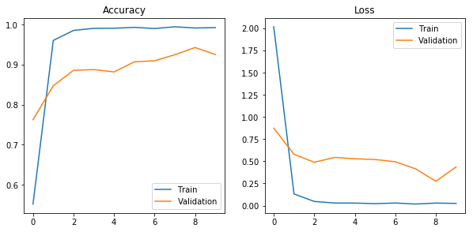

The most important one for this round is that I didn't add any dropout. From the above curve, we can see that the training accuracy is high, but the validation accuracy is low, so the model is overfitting.

#### Round 2 - Accuracy 94.8%

According to the result of last train, I added a 50% dropout.

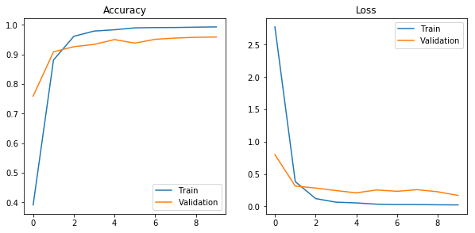

This time the model seems good, the dropout mechanism really prevents the overfitting. But the curves doesn't get to a plain stage, so it may be underfitting.

#### Round 3 - Accuracy 95.5%

Try to add more epochs.

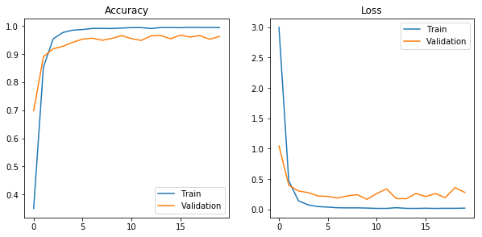

The result gets higher, but not too much.

#### Round 4 - Accuracy 85.1%

Try to increase learning rate.

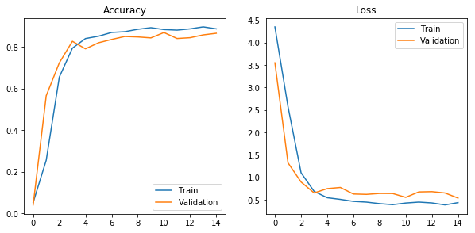

This model is bad. Obviously, after increasing the learning rate, the speed of training becomes more slower, and the test accuracy is not good enough. It seems that the optimizer cannot easily gets the right direction to the minimum.

#### Round 5 - Accuracy 93.4%

Try to increase batch size.

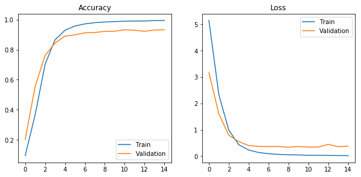

After increasing the batch size, the curve looks more smooth. But the test accuracy is not good enough, it seems to be the reason of less epochs to make the model underfitting.

#### Round 6 - Accuracy 22.6%

Try to change to SGD optimizer.

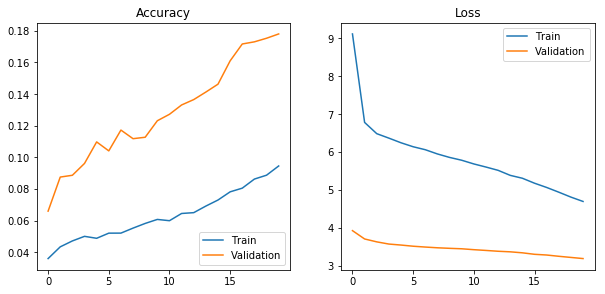

This time the model learns too slow, after 20 epochs it gets only 22.6% accuracy. Maybe more epochs will help, but I can't wait for it.

#### Round 7 - Accuracy 81.1%

Try to use image augmentation during each batch.

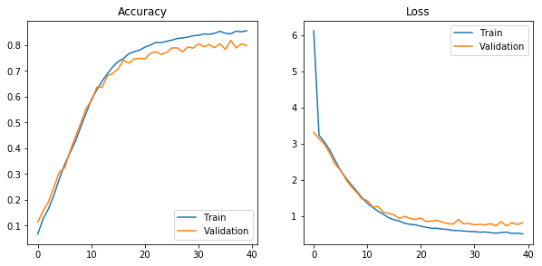

I had thought this model would have the best performance, but after training 40 epochs, it only reach 81.1% accuracy. I think I should finetune this model later.

## Test a Model on New Images

Finally, I choose the model from **Round 2** to test on real traffic signs downloaded from Internet.

Here's the top 5 softmax probabilities for each image.

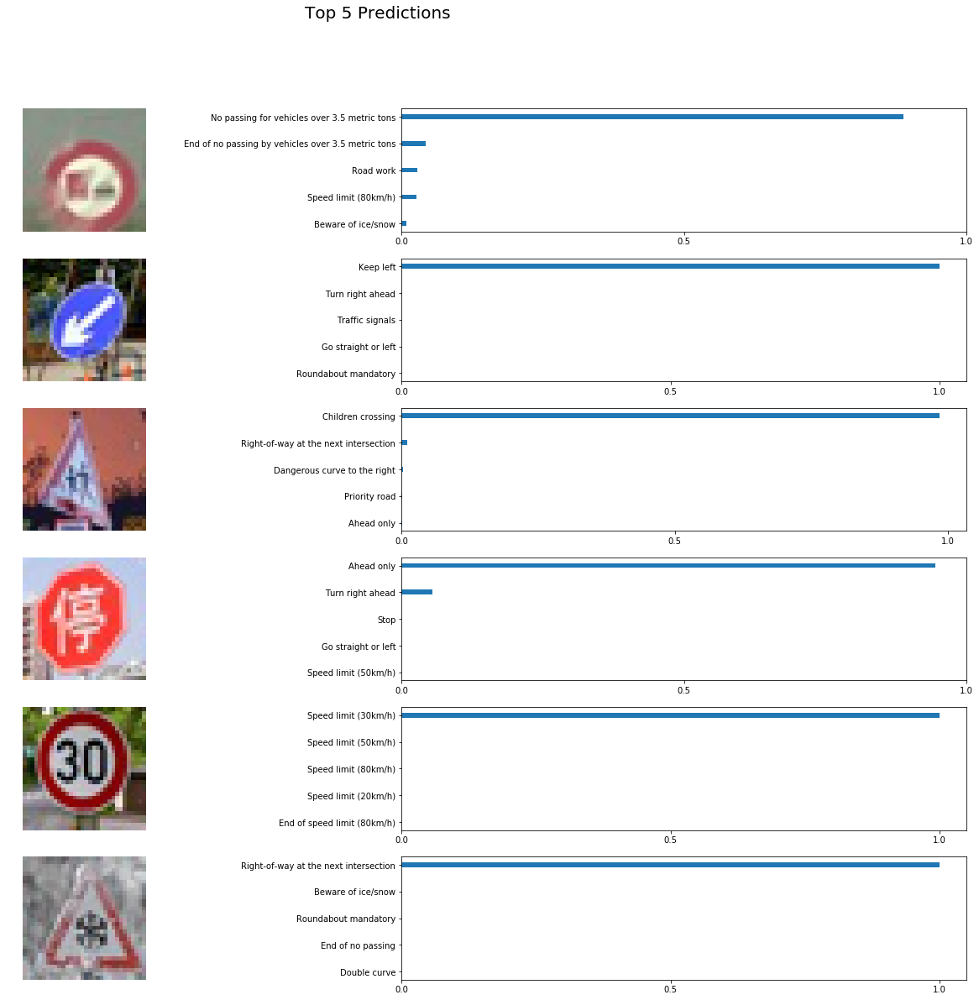

The 3rd and last images are predicted incorrect. The last one has snow covered (noises), so it's hard for the model to realize it. But in some other words, is looks a little like "Right-of-way at the next intersection". The third one the interesting one, I would have wanted it be perdicted as a stop sign (it's really a stop sign in China), because of the same shape, but this is failed.

## References

* https://stats.stackexchange.com/questions/211436/why-do-we-normalize-images-by-subtracting-the-datasets-image-mean-and-not-the-c
* https://stackoverflow.com/questions/33610825/normalization-in-image-processing
* https://medium.com/@vivek.yadav/improved-performance-of-deep-learning-neural-network-models-on-traffic-sign-classification-using-6355346da2dc
* https://becominghuman.ai/updated-my-99-40-solution-to-udacity-nanodegree-project-p2-traffic-sign-classification-5580ae5bd51f
* https://medium.com/@hengcherkeng/updated-my-99-68-solution-to-udacity-nanodegree-project-p2-traffic-sign-classification-56840768dec8
* https://chatbotslife.com/german-sign-classification-using-deep-learning-neural-networks-98-8-solution-d05656bf51ad
