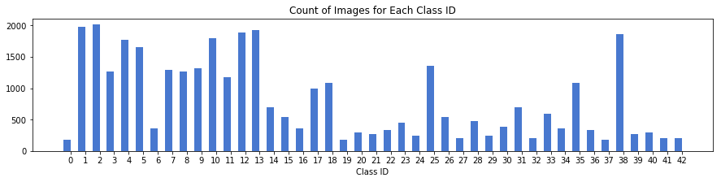
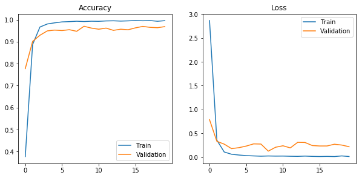
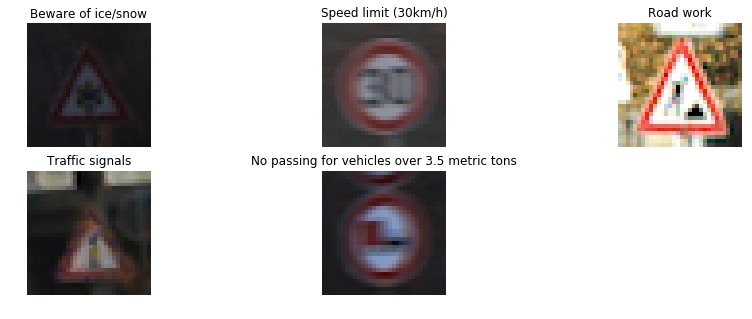

# Traffic Sign Recognition

## Data Set Summary & Exploration

### Basic Summary

This data set consists of three parts: the training set, the validation set and the test set.

| Dataset       		| Total Count	   				|
|:-----------------:|:---------------------:|
| Training         	| 34700   							|
| Validation     	  | 4410     	            |
| Test    					|	12630									|

Every image is in (32, 32, 3) shape, which size is 32*32, and has RGB color channels.

The total count of classes is 43.

### Exploration

But the count of each class is not evenly distrubuted. Some class has about 2000 images, but some less than 500. Please check the following figure.

## Design and Test a Model Architecture

### Preprocess

Every image in the data sets (train, validation and test) is grayscaled and normalized. I don't use the simple formula `(image - 128) / 128`, instead of that, I calculate the mean and standard diviation for each set.

Since converting RGB image to grayscaled image will change shape from (32, 32, 3) to (32, 32), so I use this code `image[:, :, np.newaxis]` to expand a new dimension, which size is 1. The result shape after preprocessing is (32, 32, 1). This shape is about to use in ConvNets.

### Model Architecture

I use a [VGG16](https://www.cs.toronto.edu/~frossard/post/vgg16/) like model architecture.

The VGG16 architecture can solve the more complex ImageNet data sets, so I think it can solve this task also.

| Layer         		    | Description	        					                |
|:----------------------|:----------------------------------------------|
| Input         		    | 32x32x1 grayscaled image   							      |
| Convolution 3x3     	| 1x1 stride, same padding, outputs 32x32x32 	  |
| ReLU                  |                                               |
| Convolution 3x3				|	1x1 stride, same padding, outputs 32x32x32		|
| ReLU                  |                                               |
| Max pooling 2x2	      | 2x2 stride, outputs 16x16x32 				          |
| Convolution 3x3     	| 1x1 stride, same padding, outputs 16x16x64 	  |
| ReLU                  |                                               |
| Convolution 3x3				|	1x1 stride, same padding, outputs 16x16x64		|
| ReLU                  |                                               |
| Max pooling 2x2	      | 2x2 stride, outputs 8x8x64 				            |
| Convolution 3x3     	| 1x1 stride, same padding, outputs 8x8x128 	  |
| ReLU                  |                                               |
| Convolution 3x3				|	1x1 stride, same padding, outputs 8x8x128		  |
| ReLU                  |                                               |
| Max pooling 2x2	      | 2x2 stride, same padding, outputs 4x4x128 		|
| Flatten               | outputs 2048                                  |
| Fully connected		    | outputs 1024, keep prob 0.5                		|
| Fully connected				| outputs 43        									          |
|	Softmax     					|	                        											|

### Traing the model

At the beginning, I didn't use the above architecture, but a more traditional VGG16 model, except dropping some conv layers because of the smaller image size. After training the model, I got a test accuracy around 90%, which is not suitable for submition.

I regarded an overfitting problem, so I reduce the hidden layer size and add a dropout mechanism. This time I got a very high accuracy around 96%.

I initialized the weights as truncated normal (mu = 0, sigma = 0.1), the biases for conv layers as zeros and the biases for fully connected layers as ones.

**My final model results are:**
* training set accuracy of 99.6%
* validation set accuracy of 96.9%
* test set accuracy of 96.1%

## Test the Model on New Images

I randomly choose five images from the [GTSRB_Final_Test_Images.zip](http://benchmark.ini.rub.de/Dataset/GTSRB_Final_Test_Images.zip) data set, and use some tool to convert it to shape 32x32. I choose some low quality images by intention.

Then I use my saved model to predict these images, and check it against the correct results form this file [GT-final_test.csv](http://benchmark.ini.rub.de/Dataset/GTSRB_Final_Test_GT.zip). It's 100% correct.

Here's the top 5 softmax probabilities for each image.

