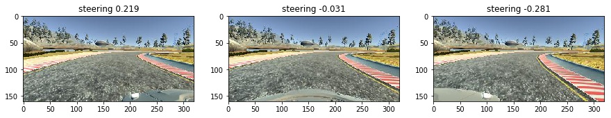
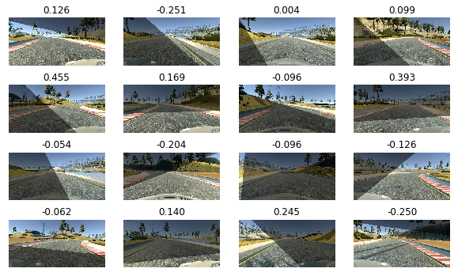

# Behavioral Cloning

## Background

This is the solution writeup for Project 3 of Udacity's Self-Driving Car Nanodegree Course. In this project, we drive a car in a dedicated simulator like playing car racing games. During the driving, the simulator collects data, which includes images taken by three front facing cameras, steering angles, throttle and brake values. Using this data, we're going to build a machine learning model to make the car driving by itself appropriately.

## Manifest

* README.md - This writeup file.
* data.py - Preprocess, augment and generate training/validation data.
* model.py - Build, train and output the model.
* drive.py - A modified version of the original drive.py file, including the preprocessing code.
* model.h5 - Trained model.
* visualization.ipynb & visualization.html - Data visualization.
* assets/ - All static asset files.

## Data Collection

Data is important to machine learning tasks. Without a great amount of high quality data, the model can do nothing valuable.

In this project, we collect data by driving a car in the simulator like what we do in real roads. There're many different road conditions, like straight paths, turnings, bridge, ups, downs and shadows of trees and wires. To drive the car using mouse is better than using keyboard, because the direction changes more smoothly.

We drive the car in three different ways:

* **The normal drive in positive direction.** The car keeps in the center of the lane as much as possible and runs at least 3 rounds.
* **On one side of the lane, and pull it back to the center.** Choose different sections of the road, and make the car run to the side, then drive it back to the center.
* **The normal drive in negative direction.**

During the driving, the simulator can collect the following data:

* Images taken by left, center and right cameras mounted in front of the car.
* Steering angles. 0 for straight, negative values for turning left and positive values for right. And all values are normalized between `-1.0` to `1.0`.
* Throttle, brake and speed. We do not use these value in the project.

All the data is recorded in a CSV file named `drving_log.csv`. Here're some randomly choosing images and their steering angles.


## Data Exploration

Here's the top 5 lines of the spreadsheet.


From the above table we can see that, the total lines of the spreadsheet are `23577`. Because one line contains three image files, so there're totally `70731 (23577 x 3)` images. All the camera images are JPG files and located in `IMG` folder. Except that, other columns are all double values.

At the very beginning, the car is running in straight, so all the steering values are `0.0`. Based on experience, we can imagine that at most of the time, the car should run in straight on Track 1.


As expected, 0 steering values are far more than others. If we use this data to fit our model, it will be more likely to predict straight directions. So we need some tricks to workaround.


In this figure, we plot all the steering values in timeline. At the first 2/3 of the figure, we can see more of the values are under 0, it means the road is leading left, the car has to constantly turn left. But in the last 1/3 of the figure, there're more above 0 values, because we're driving in a negative direction.

## Data Preprocessing

To make the model work, we need to preprocess the input data.

### Keeping the Region of Interest

We chop 50px from the top (skies and trees) and 20px from the bottom (the car hood) off the image, leaving the part of the road as ROI.

```python
# image shape is (160, 320, 3)
cropped_image = image[50:140, :, :]
```

We're going to use the NVIDIA model architecture from this [paper](https://arxiv.org/abs/1604.07316), so we need to resize all the cropped images into `66x200`.

```python
# Here IMG_COLS = 66, IMG_ROWS = 200, they are constants.
cv2.resize(cropped_image, (IMG_COLS, IMG_ROWS), interpolation=cv2.INTER_AREA)
```


## Data Augmentation

### Randomly Using the Three Cameras



The above three images are taken by three different front facing cameras, which are mounted left, center and right. Because we cannot drive a car at will, but we need to see a different perspective of the road at different angles, that's why we need these cameras. For example, if we get to see an image like the left one, which means we drive too much to the left, then we need to turn right to make the car back to the center. Reflected to steering angle, we need to add some correction value. The same to the right, which we need to substract the same correction value.

To train the model, we don't use all the three images, but randomly choose one at a time.

```python
def randomly_choose_camera(sample):
    rand = np.random.randint(3)
    if rand == 0:
        path = sample.center
        angle = sample.steering
    elif rand == 1:
        path = sample.left
        angle = sample.steering + ANGLE_CORRECTION
    else:
        path = sample.right
        angle = sample.steering - ANGLE_CORRECTION

    return transform_image_path(path), angle
```

### Horizontal Flipping

According to Figure 3, we know there're more negative values than positive. To balance them, we can randomly flip the image in horizontal and change the steering value to its opposite.

```python
def flip(image, angle):
    return np.fliplr(image), -angle
```


### Horizontal & Vertical Translation

In order to get more data, we can randomly translate the image along horizontal and vertical direction. This method can generate more perspective of the road than only using the three cameras. But when translating in horizontal, we have to adjust the steering value as well.

Here we use the [Transformation Matrix](https://en.wikipedia.org/wiki/Transformation_matrix) to do this:

```python
def translate_image(image, x_trans):
    y_trans = TRANS_Y_RANGE * np.random.uniform() - TRANS_Y_RANGE / 2
    M = np.array([[1, 0, x_trans], [0, 1, y_trans]])
    return cv2.warpAffine(image, M, (image.shape[1], image.shape[0]))

def translate_angle(angle, x_trans):
    return angle + x_trans / TRANS_X_RANGE * 2 * ANGLE_PER_TRANS
```


### Changing Brightness

We randomly change the brightness of the images to values between `0.3` to `1.2`.

```python
def change_brightness(image):
    rand = np.random.uniform(0.3, 1.2)
    hsv = cv2.cvtColor(image, cv2.COLOR_RGB2HSV)
    hsv[:, :, 2] = hsv[:, :, 2] * rand
    return cv2.cvtColor(hsv, cv2.COLOR_HSV2RGB)
```


### Randomly Adding Shadows

In order to mimic the shading of the trees and wires, we randomly change the brightness of some area of the image. We randomly draw a line in the image and darken the area above/before or below/behind the line.

```python
def add_random_shadow(image):
    h, w = image.shape[0], image.shape[1]
    shadowed_image = np.copy(image)
    shadow_value = SHADOW_VALUE

    if np.random.randint(2) == 0: # add vertical shadow
        [x1, x2] = np.random.choice(w, 2, replace=False)
        a, b = fit_line((x1, 0), (x2, h))
        add_to_left = np.random.randint(2)
        for y in range(h):
            x = int((y - b) / a)
            if add_to_left:
                shadowed_image[y, :x, :] = (shadowed_image[y, :x, :] * shadow_value).astype(np.int8)
            else:
                shadowed_image[y, x:, :] = (shadowed_image[y, x:, :] * shadow_value).astype(np.int8)
    else: # add horizontal shadow
        [y1, y2] = np.random.choice(h, 2, replace=False)
        a, b = fit_line((0, y1), (w, y2))
        add_to_above = np.random.randint(2)
        for x in range(w):
            y = int(a * x + b)
            if add_to_above:
                shadowed_image[:y, x, :] = (shadowed_image[:y, x, :] * shadow_value).astype(np.int8)
            else:
                shadowed_image[y:, x, :] = (shadowed_image[y:, x, :] * shadow_value).astype(np.int8)
    return shadowed_image
```



### Together

Here're the images after taking all of these augmentation methods.


## Data Generation

In the Data Exploration section, we've seen that there're too many near 0 angles, we should take some measures to make the angle distribution normal.


Thanks for the grate articles from [Vivek Yadav](https://chatbotslife.com/using-augmentation-to-mimic-human-driving-496b569760a9) and [Mohan Karthik](https://medium.com/@mohankarthik/cloning-a-car-to-mimic-human-driving-5c2f7e8d8aff), I can generate  steering angle distribution like the figure above. The main idea of this method is to uniformly generate a threshold, then cut off all the values (plus some bias) which are less than it.

```python
threshold = np.random.uniform()
if abs(angle) < threshold - bias or abs(angle) > 1.0:
      return None, None
```

Of course, because we have too much data to fit into memory, we use Keras generator to generate training or validation dataset once a batch, while doing all the data augmentation on demand.

```python
def train_data_generator(samples, bias, batch_size):
    x_train = []
    y_train = []
    count = 0
    samples = samples.sample(frac=1).reset_index(drop=True)
    while True:
        rand = np.random.randint(len(samples))
        sample = samples.iloc[rand]
        path, angle = randomly_choose_camera(sample)

        threshold = np.random.uniform()
        image, angle = augment(path, angle, threshold, bias)

        if image is not None:
            x_train.append(image)
            y_train.append(angle)
            count += 1

        if count == batch_size:
            yield np.array(x_train), np.array(y_train)

            x_train = []
            y_train = []
            count = 0
```

Pay attention to the **bias** parameter here, we'll go over it in Training & Tuning section.

## Model Architecture

I use the NVIDIA model without any modification. I would like to add some dropout after the convolution and dense layers to prevent overfitting, but get worse results. I think the reason for this is the model is simple enough, adding dropout will lose enough information.


## Training & Tuning

Back to the **bias** parameter above, we call the `train_data_generator` method in every epoch, and pass different bias value each time. In the beginning, the bias is `1.0`, since `np.random.uniform()` only generates [0, 1) value as threshold, so that `threshold - bias` will always be less than 0, then we're taking all the values generated by this generator. But in the next epoch, we chop off half of the bias, so that we narrow down the range of the values the generator can generate. Then repeat this process again and again, until the training terminates.

```python
def train_model(name, model, x_train, y_train):
    model.compile(loss='mse', optimizer=Adam(LEARNING_RATE))

    count = 1
    train_loss = []
    valid_loss = []
    while True:
        bias = 1.0 / count
        print('Run {}/{} (bias {:.3f})'.format(count, EPOCHS, bias))

        history = model.fit_generator(
            generator=data.train_data_generator(x_train, bias, BATCH_SIZE),
            samples_per_epoch=TRAIN_BATCH_PER_EPOCH * BATCH_SIZE,
            nb_epoch=1,
            validation_data=data.validation_data_generator(y_train, BATCH_SIZE),
            nb_val_samples=VALIDATION_BATCH_PER_EPOCH * BATCH_SIZE,
            verbose=1)
        train_loss.extend(history.history['loss'])
        valid_loss.extend(history.history['val_loss'])

        model_file_name = './{}-model-{}.h5'.format(name, count)
        print('Saving model to {}.'.format(model_file_name))
        model.save(model_file_name)

        if count == EPOCHS:
            plot_loss_curve(name, train_loss, valid_loss)
            break

        count += 1
```

I found that the tuning technique is not about the hyper-parameters of a model, but more about how data is augmented.
Using the learning rate as `0.0001` and train the model for 10 epochs is just OK.

* **Angle correction** - Using the suggested value `0.25` in the classroom is good enough.
* **Translation ranges** - The Track 2 has more ups, downs and turnings, so we need to shift the images horizontally or vertically. But how much to translate is about to tune. But unfortunately I still can't make the car drive on Track 2.
* **Angle per X/Y translation** - The same reason as above, the angle per translation also need to tune.
* **Shadows** - I add not only the vertical shadows but also the horizontal shadows, because there're more horizontal shadows in Track 2.

## Validation & Conclusion

The trained model can drive well on Track 1 but failed on Track 2. Here's the video.

<video width="320" height="160" controls>
  <source src="run.mp4" type="video/mp4">
</video>

## Further Trying

1. Find some solution to make it worked on Track 2.
2. Add more data augmentation methods, like [exponential smoothing](https://en.wikipedia.org/wiki/Exponential_smoothing), Gaussian blur, rotation and etc.
3. Try some other model architecture like common.ai, VGG and etc.
4. Translate this file into Chinese.

**References & Acknowledgement:**

* [An augmentation based deep neural network approach to learn human driving behavior](https://chatbotslife.com/using-augmentation-to-mimic-human-driving-496b569760a9)
* [Cloning a car to mimic human driving](https://medium.com/@mohankarthik/cloning-a-car-to-mimic-human-driving-5c2f7e8d8aff)
* [Behavioral Cloning for Self Driving Car](https://github.com/ancabilloni/SDC-P3-BehavioralCloning)
* [Teaching a car to drive itself](https://chatbotslife.com/teaching-a-car-to-drive-himself-e9a2966571c5)
* [Learning human driving behavior using NVIDIA’s neural network model and image augmentation](https://chatbotslife.com/learning-human-driving-behavior-using-nvidias-neural-network-model-and-image-augmentation-80399360efee)
* [End-to-end learning for self-driving cars](https://navoshta.com/end-to-end-deep-learning/)
* [CNN Model Comparison in Udacity’s Driving Simulator](https://towardsdatascience.com/cnn-model-comparison-in-udacitys-driving-simulator-9261de09b45)
