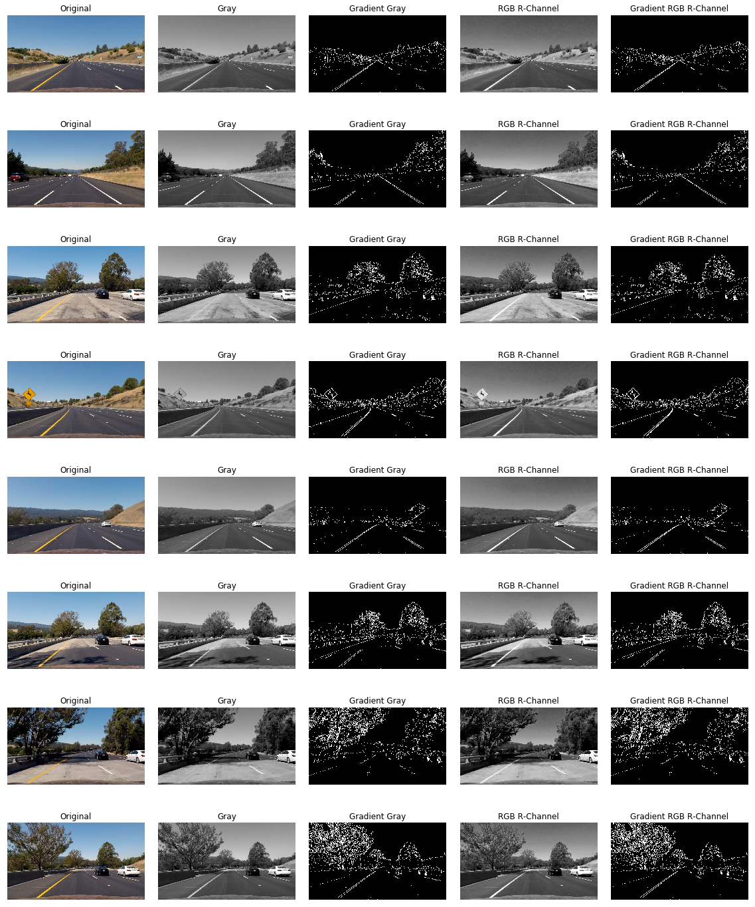
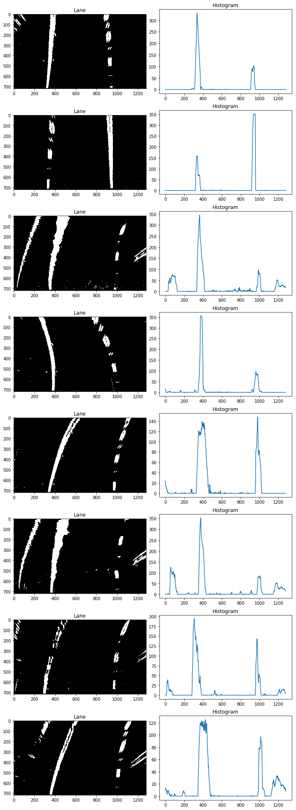

# Advanced Lane Finding

## Background

The goal of this project is to use a more advanced method to find the lane on the road. Unlike Project 1, the method used in this project can find not only the straight lane but also the turning lane. What we should have done in this project list below:

* Compute the camera calibration matrix and distortion coefficients given a set of chessboard images.
* Apply a distortion correction to raw images.
* Use color transforms, gradients, etc., to create a thresholded binary image.
* Apply a perspective transform to rectify binary image (birds-eye view).
* Detect lane pixels and fit to find the lane boundary.
* Determine the curvature of the lane and vehicle position with respect to center.
* Warp the detected lane boundaries back onto the original image.
* Output visual display of the lane boundaries and numerical estimation of lane curvature and vehicle position.

## Manifest

* README.md - You're reading it.
* solution.ipynb & solution.html - The solution notebook.
* project\_video\_output.mp4 - The output video.
* assets/ - All static asset files.

## Camera Calibration

### Finding Chessboard Corners

When light rays enter the camera through the lenses, many factors will make the images distorted. E.g. the rays pass through the edge of the curved lenses, or the lens is not aligned parallel to the imaging plane. Therefore, we need to calibrate the camera and undistort the images.

We use chessboard images to do camera calibration. In this project, we're providing 20 chessboard images pre-taken from different distances and angles. We first need to point out all the object points inside the chessboard, then use `cv2.findChessboardCorners` method to find the image points. Since all these images are taken on the same chessboard, for each image, we put the same object points into a list (`objpoints`), and put the corresponding found image points into another list (`imgpoints`). In order to check if we find the correct image points, we can use `cv2.drawChessboardCorners` method to visualize.


As can be seen, the images *calibration1.jpg*, *calibration4.jpg* and *calibration5.jpg* are marked as failed. Because the rest of the images all have `9x6` corners, but those that fail are not.

### Calibrating the Camera

After having the `objpoints` and `imgpoints` arrays, we can use `cv2.calibrateCamera` method to compute camera calibration matrix (`MTX`) and distortion coefficients (`DIST`).

### Undistorting the Images

Use `cv2.undistort` method and the computed `MTX` and `DIST` as parameters, we can undistort any images taken by this camera. Here're the results of undistorted chessboard images and test images.


As can be seen from the first group of images, the treatment effect is very obvious.


These test images are not very effective treatment, but we can still find the differences from the hood at the bottom of the images.

## Pipeline

### Generating Thresholded Binary Images

In order to find the lane on the road, we have to make sure where the lane lines are, and to which direction they lead. Humans can do this easily by observing the world, we can distinguish between different colors, shapes and curvatures. But it's hard for computers to archieve this. Thanks to the computer vision technologies, we can use programs to accomplish such a job.

Before starting the job, we should explore out test sets first. By exploring, we can decide which kind of techniques to use.

#### Exploring Different Color Spaces

##### RGB Color Space

The default color space of an image is the well known RGB (or BGR) color space, we first start from here.


We split each color channel from the RGB color space and draw it as a grayscale. From the above figure, we can see that, in blue channel, the yellow lines almost vanish. So using this color channel to extract yellow lines is a bad idea. Using the same way, we may realize that in the red channel, the lane lines are more distinct from the road surface.

We can convert RGB into some other color spaces (like HSV, HLS and Lab) using `cv2.cvtColor` method. Let's do this one by one.

##### HSV Color Space

**HSV** stands for Hue, Saturation and Value.


We can find that, the yellow lines turn black in the hue channel, and have a strong contrast with the road surface in the saturation channel.

##### HLS Color Space

**HLS (or HSL)** stands for Hue, Lightness, and Saturation.


By comparing HSV and HLS color spaces we may find that the latter one is better than former one. Let's take the first row as an example:

1. In hue channel, they're the same.
2. In saturation channel, they can both show the yellow lines, but HLS color space can even show parts of the white lines.
3. The lightness channel is less effective than the value channel.

So we decide to use this color space in the following processes.

##### Lab Color Space

In [**Lab** color space](https://en.wikipedia.org/wiki/Lab_color_space), **L** for lightness, **a** and **b** for the color opponents green–red and blue–yellow.


From this picture, we can see that, the larger the b value, the more yellow the color. So we can imagine to extract the yellow lines from the b channel in Lab color spaces.


Yes, the yellow lines in the b channel is very dazzling.

#### Color and Gradient Thresholding

We can easily find the yellow lines from the b channel in Lab color space, but it seems no easy way to extract the white lines, so we have to use a combination of methods.

In the previous section, we decice to use HLS color space to extract lane lines. So let's first draw some thresholded binary images for each channel.

##### Thresholded H-Channels


##### Thresholded L-Channels


##### Thresholded S-Channels


##### Put Them Altogether


So far, we can find some white lines, but not all of them.

##### Thresholded Gradient

Using only the color selection is not enough, we can combine with gradient selection. From the previous figure, we can see that, there're two major problems about color selection. First because of blurring, it's hard for color selection to extract the edge of the lines. Second it's not very sensitive to extract far-end dashed white lines.

We use Sobel Operator to compute x-gradient, y-gradient, magnitude and direction of the gradient, then tune the threshold to find the best result.



We use the common grayscaled image and the red color channel to test on gradient selection, but cannot figure obvious difference out. And as can be seen, gradient selection is more inclined to choose the edges, and sensitive to the far-end parts.

##### Thresholded b-Channels


We've already talked about perfectly choosing the yellow lines by using the b channel in Lab color space.

#### Generating Binary Images


Combine using the color selection and gradient selection, we can find the lane lines perfectly from other objectives. The list of all used thresholds is as follows:

| Name                  | Thresholds |
|-----------------------|------------|
| HSL H-Channel         | 0 ~ 80     |
| HSL L-Channel         | 120 ~ 255  |
| HSL S-Channel         | 100 ~ 255  |
| Absolute X Gradient   | 25 ~ 255   |
| Magnitude of Gradient | 110 ~ 255  |
| Direction of Gradient | 0.7 ~ 1.2  |
| Lab b-Channel         | 160 ~ 255  |

### Finding and Fitting the Line Curves

#### Perspective Transform

In order to find the lines, we must first transform from front-facing view into the bird's-eye view using perpsective transform. We need to choose some source points and the corresponding destination points to do the transformation. In OpenCV, we can use `cv2.getPerspectiveTransform` method to compute the transformation matrix, and can exchange the sources and destinations to compute the invert transformation matrix.

The choosen of the source and destination points are as follows:

| Source   | Destination   |
|----------|---------------|
| 585, 450 | OFFSET, 0     |
| 695, 450 | W - OFFSET, 0 |
| 1127, H  | W - OFFSET, H |
| 203, H   | OFFSET, H     |

*Note: **W** stands for image width, **H** stands for image height, and **OFFSET** here equals to `320`.*


#### Sliding Window Search

After extracting the lane lines and perspective transform, we finally get a bird's-eye view of the ROI. After that, we need to get the exact coordinates of the pixels that make up the left and right lines. When we know nothing about the positon of the lines, we can use the Sliding Window Search method to do a blind search.



We draw a histogram of the lower half of the bird's-eye view. As can be seen from the figure, the locations of the two peak positions are where the lane lines are located. We can start from these positions then search along the height direction via a small sliding window. We calculate the average x position of each point in first sliding window, then use this value as the starting of next sliding window and so on. After the search, we've collected lots of positions inside the lines, then we can fit the curve using a quadratic polynomial.


#### Previous Fit Search

After we have got a fitting result, we can use this result for a more accurate search. Instead of calculate the mean value inside the sliding window, we can calculate a more accurate value using the previous fit result.


We can see that, the drawback of previous fit search is that it may fail if the differences between two frames are large. In this case, we have to return back to sliding window search.

### Calculating the Summary Data

So far we have fitted the two lane lines using quadratic polynomial. Next, we need to calculate the radius of curvature of the curve and vehicle position with respect to center. However, until then, all of our calculations were based on pixel units, where we need to convert to real world units.

```python
f = A * y ** 2 + B * y + C
R = (1 + (2 * A * y0 + B) ** 2) ** 1.5 / abs(2A)
```

In order to transform pixel units into real world units, we need two conversion factors:

```python
YM_PER_PIX = 30 / 720
XM_PER_PIX = 3.7 / 700
```

| No. | Left RoC (m) | Right RoC (m) | Position of Center (cm) |
|-----|--------------|---------------|-------------------------|
| 1   | 10240.6      | 2292.9        | 4.76                    |
| 2   | 14473.2      | 5513.8        | 1.60                    |
| 3   | 1283.6       | 650.8         | -8.64                   |
| 4   | 457.3        | 345.0         | -21.37                  |
| 5   | 565.1        | 550.8         | -9.91                   |
| 6   | 963.2        | 560.2         | -21.72                  |
| 7   | 647.6        | 406.9         | 1.80                    |
| 8   | 900.5        | 863.5         | -18.44                  |

*Remark:*
*1. The first two Left RoCs are larger than 10km, since they're nearly the straight lines.*
*2. In the `Position of Center` column, negative value means left, positive value means right.*

### Result

Until now, we have all we need: fitted lines and summary data. The last step is to draw an overlay to hightlight the lane found then use invert perspective transforms matrix to warp it back onto the raw image.


### Processing the Video

In order to do the smoothing and sanity check, we've used a `Line` class to track the last 5 results. Every time we've computed a result, then add it to the `Line` class instance. Compute the average value of these results to get a best fit. We use this best fit value to draw highlighted overlay on the frame. We also check the differences of the current fit and best fit values to check if the current fit is an accurate value.

<video width="640" height="360" controls>
  <source src="./project_video_output.mp4" type="video/mp4">
</video>

## Discussion

The algorithm does not work under the following conditions:

1. When the roadbed and the lane line are close.
2. When the road has a lot of noise (shades, different pavement colors, other edges, etc.).
3. When other pedestrians appear within the field of view.
4. When the glass appears reflection.

## References & Acknowledgements

**Articles**

* [Udacity Self-Driving Car Nanodegree Project 4 - Advanced Lane-Finding](http://jeremyshannon.com/2017/03/03/udacity-sdcnd-advanced-lane-finding.html) by Jeremy Shannon
* [Advanced Lane Line Project](https://chatbotslife.com/advanced-lane-line-project-7635ddca1960) by Arnaldo Gunzi
* [Robust lane finding using advanced computer vision techniques: Mid project update](https://towardsdatascience.com/robust-lane-finding-using-advanced-computer-vision-techniques-mid-project-update-540387e95ed3) by Vivek Yadav

**Implementations**

* https://github.com/mohankarthik/sdcnd/tree/master/projects/term1/P4-AdvancedLaneLines
* https://github.com/jessicayung/self-driving-car-nd/tree/master/p4-advanced-lane-lines
* https://github.com/asgunzi/ArnaldoGunzi\_CarNDAdvancedLaneFinding
* https://github.com/jeremy-shannon/CarND-Advanced-Lane-Lines
