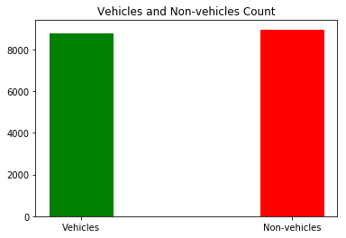
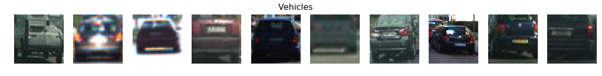
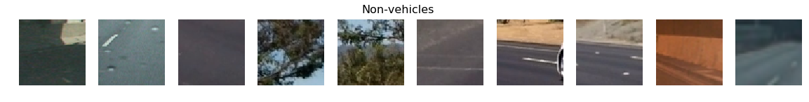
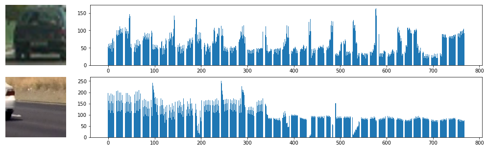
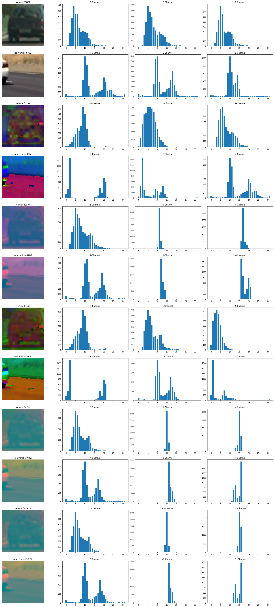
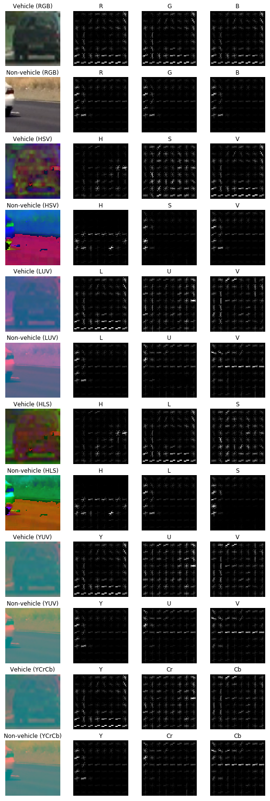
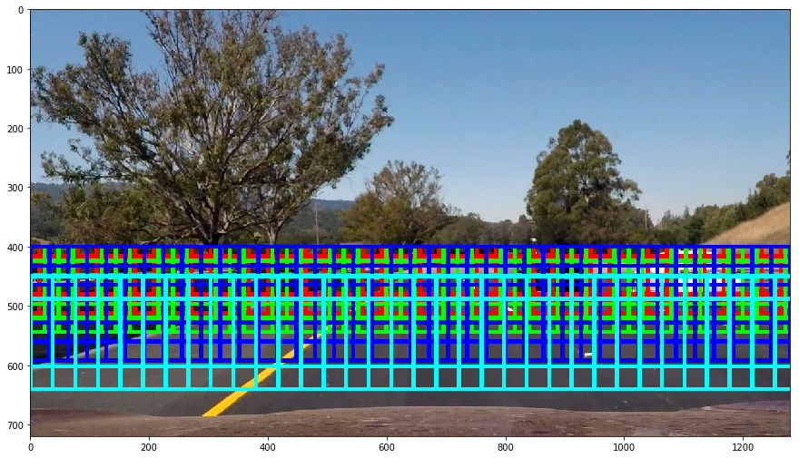
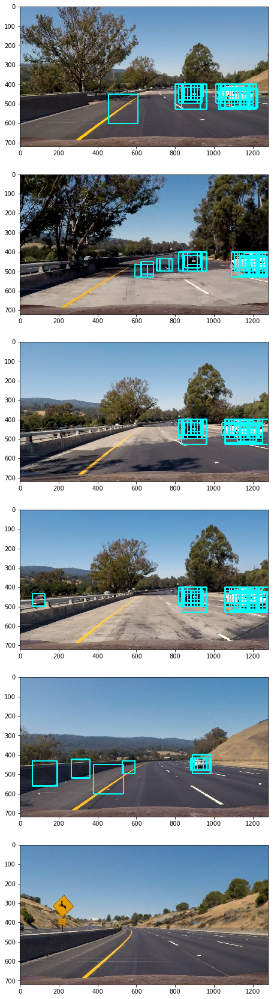
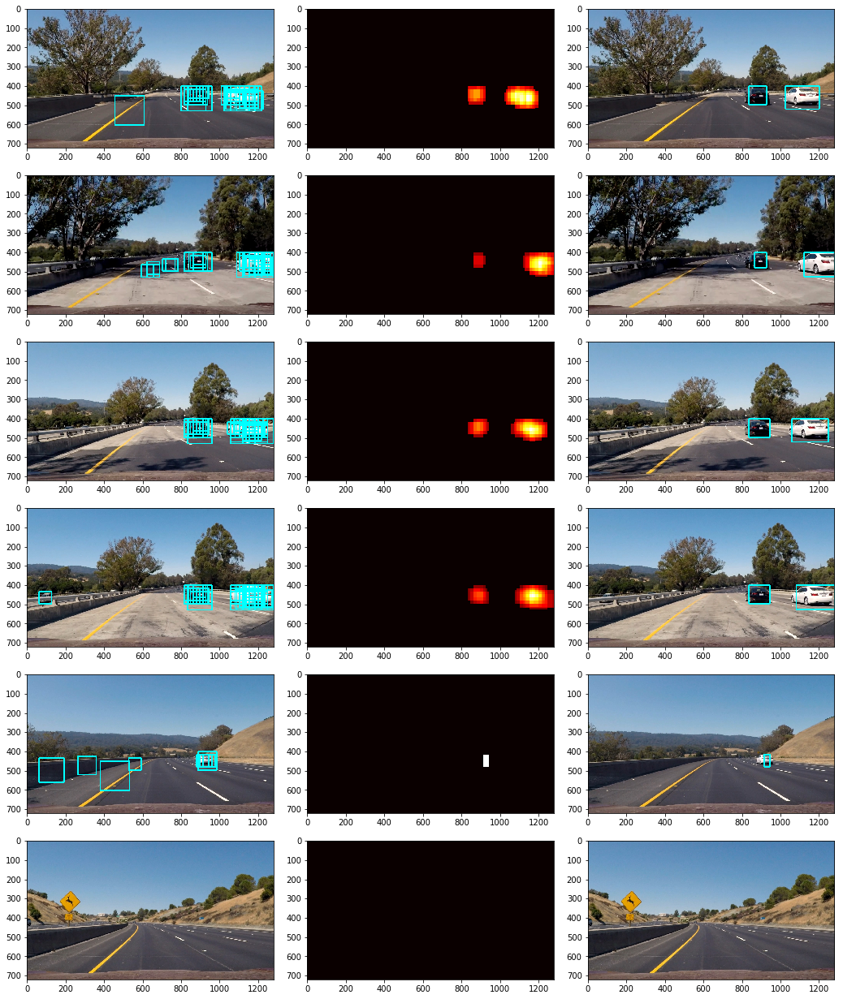

# Vehicle Detection

## Background

This is the last project of Term 1 for Udacity's Self-Driving Car Engineer Nanodegree Program. Some vehicle and non-vehicle images are provided and we're going to build a machine learning pipeline to identify vechiles on the road.

## Manifest

* README.md - You're reading it.
* solution.ipynb & solution.html - The solution notebook.
* model.p - SVM model and final parameters.
* project\_video\_out.mp4 - Output video.
* assets/ - Static files used in this README.

## Feature Extraction

No matter which algorithm to choose, we ought to decide which features to extract. Feature selection plays a key role in model construction. But at first, let's explore the given dataset.

This dataset comes from a combination of the GTI vehicle image database, the KITTI vision benchmark suite, and examples extracted from the project video itself. All these images are labeled as vechile and non-vechile.



As can be seen from the above figure, the classes of this dataset seem to be balanced, so no augmentation is needed. Here're some samples:




### Color Space

RGB is a well-known color space, but not always appropriate for computer vision. So we have to try different color sapces to find the best feature combination. Some other useful color spaces are: **HSV**, **LUV**, **HLS**, **YUV** and **YCrCb**.

### Spatial Feature

The spatial features are simple enough, just resize the image to a fixed size, then flatten the result to a 1-D array. Here are spatial features in RGB color space for vehicle and non-vehicle samples.



Can be seen from the above figure, the two images have different distribution patterns.

### Color Histogram Features

The color histogram features are extracted from each channel of the specified color space. Colors in this channel are divided into several bins in the histogram.

The following figure shows color histogram features of the same vehicle and non-vehicle samples.



We can find that all channels in RGB, HSV and HLS color space, L channel in LUV color space, Y channel in YUV and YCrCb color space are different from each other, we can use these color channels to extract color histogram features.

### HOG Features

HOG is short for Histogram of Gradients, as the name suggests, it uses gradients but not the direct color values to extract features.



It can be seen that in different channels of different color space, HOG has a significant difference. It means that HOG is very useful to distinguish vechile and non-vehicle images.

## Training Classifier

There're many parameters to choose during training the SVM classifier to find the best combination. I've done a lot of experiments to find a more accurate and faster combination of parameters and features. The following table shows the whole progress.

*Note: In order to make the test run fast, we use a mini batch of the whole dataset, which contains 2000 vehicle samples and 2000 non-vehicle samples. Then the 4000 samples are splited into training set and test set by 80/20.*

Column meanings:

* **Color Space** - which color space to use
* **Spatial** - whether to enable spatial features
* **Size** - to which size to resize the original image
* **Color Hist** - whether to enable color histogram features
* **Bins** - how many bins to divided in the histogram
* **Channels** - from which color channel to compute the histogram
* **HOG** - whether to enable HOG features
* **Channels** - from which color channel to compute the HOG
* **Origent** - how many gradient orientations to compute
* **pix/cell** - pixels per each cell
* **cell/block** - cells per each block
* **Features** - hwo many features to extract
* **Test Acc** - accuracy score on test dataset
* **Time** - total time of feature extraction, train the model and calculate test accuracy score

| Color Space | Spatial  | Size  | Color Hist | Bins | Channels | HOG     | Channels | Orient | pix/cell | cell/block | Features | Test Acc     | Time       |
|-------------|----------|-------|------------|------|----------|---------|----------|--------|----------|------------|----------|--------------|------------|
| RGB         | Enabled  | 32x32 | Enabled    | 32   | 0, 1, 2  | Enabled | 0, 1, 2  | 9      | 8        | 3          | 11916    | 94.75%       | 64.61s     |
| RGB         | Enabled  | 16x16 | Enabled    | 32   | 0, 1, 2  | Enabled | 0, 1, 2  | 9      | 8        | 3          | 9612     | 95.37%       | 56.37s     |
| RGB         | Enabled  | 16x16 | Enabled    | 32   | 0, 1, 2  | Enabled | 0, 1, 2  | 9      | 16       | 3          | 1836     | 97.62%       | 16.29s     |
| RGB         | Enabled  | 16x16 | Enabled    | 32   | 0, 1, 2  | Enabled | 0, 1, 2  | 9      | 16       | 2          | 1836     | 97.00%       | 20.24s     |
| RGB         | Enabled  | 8x8   | Enabled    | 32   | 0, 1, 2  | Enabled | 0, 1, 2  | 9      | 16       | 3          | 1260     | **98.12%**   | **15.19s** |
| RGB         | Disabled |       | Disabled   |      |          | Enabled | 0, 1, 2  | 9      | 16       | 2          | 972      | 93.75%       | 16.96s     |
| RGB         | Disabled |       | Disabled   |      |          | Enabled | 0, 1, 2  | 9      | 8        | 2          | 5292     | 90.38%       | 56.95s     |
| RGB         | Disabled |       | Enabled    | 32   | 0, 1, 2  | Enabled | 0, 1, 2  | 9      | 16       | 2          | 1068     | 96.75%       | 19.15s     |
| LUV         | Enabled  | 16x16 | Enabled    | 32   | 0        | Enabled | 0, 1, 2  | 9      | 8        | 3          | 9548     | **98.38%**   | 42.89s     |
| LUV         | Enabled  | 16x16 | Enabled    | 32   | 0        | Enabled | 0, 1, 2  | 9      | 16       | 3          | 1772     | **98.25%**   | **13.79s** |
| LUV         | Enabled  | 16x16 | Enabled    | 32   | 0        | Enabled | 0, 1, 2  | 9      | 8        | 2          | 6092     | 97.25%       | 47.38s     |
| LUV         | Enabled  | 16x16 | Enabled    | 32   | 0, 1, 2  | Enabled | 0, 1, 2  | 9      | 16       | 2          | 1836     | **98.25**    | **18.21s** |
| LUV         | Enabled  | 16x16 | Enabled    | 32   | 0, 1, 2  | Enabled | 0, 1, 2  | 9      | 16       | 3          | 1836     | **98.50%**   | **15.18s** |
| YUV         | Enabled  | 32x32 | Enabled    | 32   | 0        | Enabled | 0, 1, 2  | 9      | 8        | 3          | 11852    | 97.62%       | 41.87s     |
| YUV         | Enabled  | 16x16 | Enabled    | 32   | 0        | Enabled | 0, 1, 2  | 9      | 8        | 3          | 9548     | **98.12%**   | **40.75s** |
| YUV         | Enabled  | 16x16 | Enabled    | 32   | 0        | Enabled | 0, 1, 2  | 9      | 16       | 3          | 1772     | 97.38%       | 12.73s     |
| YUV         | Enabled  | 16x16 | Enabled    | 32   | 0        | Enabled | 0, 1, 2  | 9      | 16       | 2          | 1772     | 97.75%       | 15.93s     |
| YUV         | Enabled  | 16x16 | Enabled    | 32   | 0, 1, 2  | Enabled | 0, 1, 2  | 9      | 16       | 3          | 1836     | 97.62%       | 14.75s     |
| YCrCb       | Enabled  | 16x16 | Enabled    | 32   | 0        | Enabled | 0, 1, 2  | 9      | 16       | 2          | 1772     | 97.75%       | 16.39s     |
| YCrCb       | Enabled  | 16x16 | Enabled    | 32   | 0, 1, 2  | Enabled | 0, 1, 2  | 9      | 8        | 2          | 6156     | 97.62%       | 48.91s     |
| YCrCb       | Enabled  | 16x16 | Enabled    | 32   | 0, 1, 2  | Enabled | 0, 1, 2  | 9      | 16       | 2          | 1836     | **98.00%**   | **17.87s** |
| YCrCb       | Enabled  | 16x16 | Enabled    | 32   | 0, 1, 2  | Enabled | 0, 1, 2  | 12     | 16       | 2          | 2160     | **99.38%**   | **18.66s** |
| YCrCb       | Enabled  | 16x16 | Enabled    | 32   | 0, 1, 2  | Enabled | 0, 1, 2  | 9      | 16       | 1          | 1296     | 97.25%       | 22.27s     |
| YCrCb       | Enabled  | 32x32 | Enabled    | 32   | 0, 1, 2  | Enabled | 0, 1, 2  | 9      | 16       | 2          | 4140     | **98.25%**   | **19.80s** |
| YCrCb       | Enabled  | 32x32 | Enabled    | 32   | 0, 1, 2  | Enabled | 0, 1, 2  | 9      | 8        | 2          | 8460     | 97.75%       | 50.67s     |
| YCrCb       | Disabled |       | Disabled   |      |          | Enabled | 0, 1, 2  | 9      | 16       | 2          | 972      | 94.87%       | 15.50s     |

The final selection of parameters are as the following, which gets a test accuracy score up to 99.38% and runs for less than 20 seconds for the mini batch dataset.

```python
final_params = {
    'color_space': 'YCrCb',
    'spatial_enabled': True,
    'spatial_size': (16, 16),
    'color_hist_enabled': True,
    'color_hist_bins': 32,
    'color_hist_channels': (0, 1, 2),
    'hog_enabled': True,
    'hog_channels': (0, 1, 2),
    'hog_orientations': 12,
    'hog_pix_per_cell': 16,
    'hog_cell_per_block': 2
}
```

At last, we get 98.90% test accuracy score on the whole dataset.

## Sliding Window Search

We use different sizes of windows to search across the whole image. Since the car far away is small, and near by is big, we use a smaller sliding window at the top part of the ROI, and bigger window at the bottom.



| y-Top | y-Bottom | Size    | Overlap   | Color |
|-------|----------|---------|-----------|-------|
| 400   | 500      | 64x64   | 0.75x0.75 | Red   |
| 400   | 500      | 96x96   | 0.75x0.75 | Green |
| 400   | 550      | 128x128 | 0.75x0.75 | Blue  |
| 450   | 600      | 152x152 | 0.75x0.75 | Cyan  |

The computing pipeline is like the following:

1. Resize the images within the window to the size of 64x64, which is the same as the training dataset.
2. Extract features using the parameters we have choosen.
3. Predict whether the image is a vehicle or not using the trained SVM model.
4. Mark it (only for visualization).



## Remove False Positives

As can be seen from the above, SVM classifier can generate many false positive, we have to remove them.

### Remove False Positives in One Frame

Also from the above figure, we may find that the portion surrounding the vehicle is more often identified as true positive, so we can create a heatmap to show how many sliding windows donating positive. Then just threshold the heatmap to some value, can remove false positives in one frame.



Which threshold value to choose is a question that needs to be weighed. If we choose a larger value, we can remove most of the false positives, but can also remove some true positives, then make us not be able to find some vehicles (especially the far and small cars). So here we choose a value of **3**.

### Remove False Positives in Frame Stream

Only using one frame to remove most false positives but keep true positives is hard, so we have to resort to frame stream. The algorithm is based on the assumption that false positives are random and that false positives occur across multiple frames in the same place are very rare. So we can sum the heatmaps of several frames up, then threhold it to another value.

```python
class HeatmapBuffer:
    def __init__(self):
        self.max_length = 20
        self.buffer = None
        self.current = 0
        self.real_length = 0

    def sum_heatmap(self, heatmap):
        if self.buffer is None:
            self.buffer = np.zeros([self.max_length, heatmap.shape[0], heatmap.shape[1]], dtype=np.float64)

        self.buffer[self.current] = heatmap
        self.current += 1
        if self.current >= self.max_length: self.current = 0
        if self.real_length < self.max_length:self.real_length += 1
        threshold = self.real_length * 1.2
        if threshold < 3: threshold = 3
        return np.sum(self.buffer, axis=0), threshold
```

Here we introduce a magic number **1.2** to adjust the threshold value across frames.

## Discussion & Problems

This algorithm pipelines cannot remove all false positive but keep tracking the vehicles well. I can use some other machine learning techines like CNN to train the model, I think it should be better than SVMs.

The given training dataset is not good, it can only well detect the tail and side of the car, but not the head. I can use the new Udacity's training data to start over.

The size of the sliding window need to be tuned too, that can make the bounding boxes more tight to the vehicles.

The algorithm is slow, on my 2.3 GHz Intel Core i7 Macbook Pro, it processes each frame more than 3 seconds. I can use the sub-sampling method and reduce the number of sliding windows to boost the performance.

## References & Acknowledgements

**Articles**

* [Vehicle Detection with Mask-RCNN and SSD on Floybhub: Udacity Self-driving Car Nano Degree](https://shaoanlu.wordpress.com/2017/05/07/vihicle-detection-using-ssd-on-floybhub-udacity-self-driving-car-nano-degree/) by SHAOANLU
* [Detect and Classify Species of Fish from Fishing Vessels with Modern Object Detectors and Deep Convolutional Networks](https://flyyufelix.github.io/2017/04/16/kaggle-nature-conservancy.html) by Felix Yu
* [A Trick to Quickly Explore HOG parameters for Udacity’s Vehicle Detection and Tracking Project (99.1% test accuracy achieved)](https://medium.com/@matlihan/a-trick-to-quickly-explore-hog-features-for-udacity-vehichle-detection-and-tracking-project-0-991-8b6f682a0b01) by Musa Atlıhan
